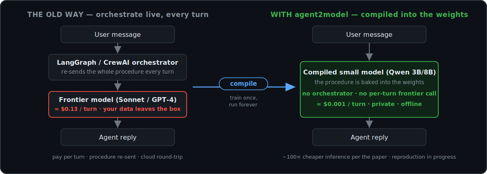
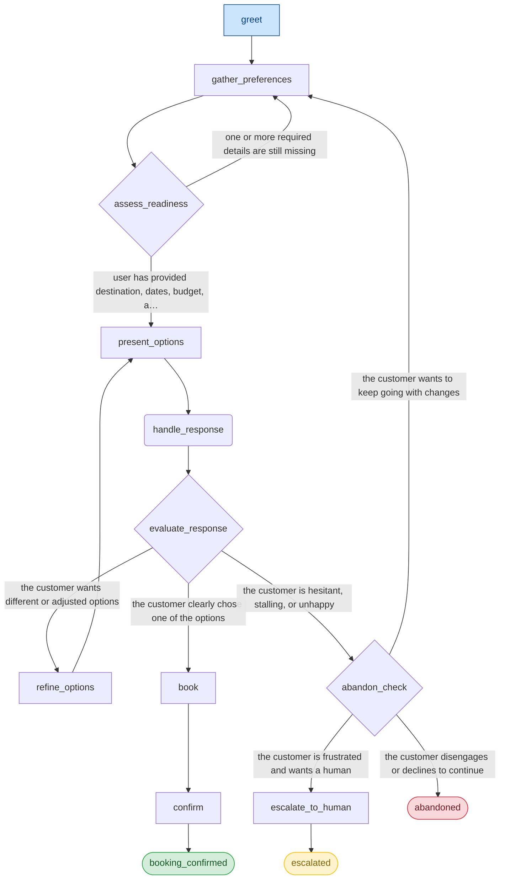

<div align="center">

# agent2model

### Turn your LangGraph agent into a small open model that runs with **no orchestrator**.



[](https://github.com/kamaalg/agent2model/actions/workflows/ci.yml)
[](https://pypi.org/project/agent2model/)
[](https://pypi.org/project/agent2model/)
[](https://www.python.org/)
[](https://github.com/kamaalg/agent2model/blob/main/LICENSE)
[](#what-v1-ships)

*Point `agent2model` at an agent procedure (a LangGraph graph, or a YAML flowchart) and it bakes the whole procedure into a small open model's **weights** — so at runtime the model self-orchestrates **privately, offline, with no orchestrator and no per-turn frontier calls.** The method ([Dennis et al. 2026](https://arxiv.org/abs/2605.22502)) reports near-frontier quality at **128–462× lower inference cost**; those are the paper's figures, **not yet reproduced here**. What this repo ships today is the open pipeline **and an eval harness that measures whether a compiled model actually follows the procedure** — see [Benchmarks](#benchmarks).*

</div>

---

## How it works

You describe your agent's procedure once — or import it from a LangGraph
`StateGraph`. `agent2model` walks the procedure, has Claude write thousands of
synthetic conversations through every possible path, and fine-tunes a small
open-source model on those conversations. The result: a self-contained model
that *knows* the procedure — no external orchestrator, no per-turn frontier calls.

**How it differs from what you already use:** prompt-optimizers like DSPy and GEPA
make a frontier model follow a procedure better but keep a runtime program;
orchestrators like LangGraph and CrewAI run the procedure live on every turn.
`agent2model` is the only one that removes the orchestrator entirely by baking the
procedure into the weights.

Based on Dennis et al. 2026, *Compiling Agentic Workflows into LLM Weights*
([arXiv:2605.22502](https://arxiv.org/abs/2605.22502)).

---

## The 4-command pipeline

```bash
# 0. Copy a bundled example into your working dir (they ship inside the package).
agent2model init travel_booking

# 1. Validate a workflow and emit the canonical IR.   [free, offline, no GPU]
agent2model compile travel_booking/flowchart.yaml --out build/travel

# 2. Generate synthetic training conversations via Claude.  [Anthropic API $; --budget caps it]
agent2model generate build/travel --n 2000 --budget 60

# 3. Fine-tune Qwen 2.5/3 on the generated data.      [needs a GPU + the [train] extra]
agent2model train build/travel --base Qwen/Qwen2.5-3B-Instruct --epochs 20

# 4. Evaluate against baselines, then serve via vLLM.  [eval = Anthropic API $; serve needs a GPU]
agent2model eval  build/travel --baselines in_context,langgraph --n 200
agent2model serve build/travel --port 8000
```

> **Cost/hardware at a glance:** `compile` is free and offline. `generate` and
> `eval` make Anthropic API calls (each prints an estimate first and is capped by
> `--budget`). `train` and `serve` need a GPU — locally with the `[train]`/`[serve]`
> extras, or on Modal (below) if you have no GPU. A full paper reproduction
> (generate → train → eval) runs ~$30–50 end-to-end.

Don't have a GPU? **The whole pipeline runs on Modal:**

```bash
agent2model cloud setup                                # one-time wizard
agent2model cloud run my_workflow.yaml --size 3b --n 2000 --epochs 20
```

---

## Start from the agent you already have

You don't have to write YAML. If your procedure already lives in a **LangGraph
`StateGraph`**, point `compile` straight at the `.py` and `agent2model` extracts
the nodes, edges, and decision points into the IR for you:

```bash
pip install "agent2model[langgraph]"                  # needed only to import a .py graph
agent2model compile my_graph.py --out build/mine      # LangGraph → IR, automatically
```

> Compiling a `.py` graph **imports and runs it** — only point `compile` at files
> you trust (see [docs/adapters.md](https://github.com/kamaalg/agent2model/blob/main/docs/adapters.md)).
> The adapter recovers the procedure's *structure* (nodes/edges/branches); you then fill
> in node prompts and terminal types where they can't be inferred (`generate` will
> refuse until the placeholder `TODO:` prompts are replaced). **CrewAI Flows** and
> **Oracle Agent Spec** import are on the near-term roadmap.

Prefer to author from scratch, or have no existing graph? Write the
[Flowchart IR](#the-flowchart-ir) directly — it's a few lines of YAML.

---

## See what you compiled

`compile` writes a Mermaid diagram next to the IR, and `agent2model show <build>`
prints it on demand — so you can *eyeball the exact procedure* that's about to be
baked into the weights (free, offline, no API key). Here's the bundled
travel-booking example, rendered straight from the compiled IR:



Diamonds are `decision` nodes (resolved only at generation time), rounded boxes are
`user` turns, and terminals are coloured by outcome. `agent2model show <build> --format
summary` prints node/path counts instead.

### Preview the whole pipeline offline — no API key, no GPU

Want to see the dataset shape and the eval report before spending a cent?

```bash
agent2model generate build/travel --n 5 --mock   # templated conversations, $0, no key
agent2model eval     build/travel --demo          # render the JSON + PDF eval report
```

`--mock` writes a templated (non-LLM) `dataset.jsonl` so you can inspect the
chat-template format and sampled paths; `--demo` renders the real report layout
(per-criterion bars, bootstrap CIs, failure rates, cost breakdown) from illustrative
scores. Both are clearly labelled as previews — **not** training data or measured
results.

---

## Results from the paper (Dennis et al. 2026)

> These are the **paper's** published targets, reproduced here as the benchmark we
> hold ourselves to. Independently-reproduced numbers (this repo, your hardware) are
> tracked in [`benchmarks/`](https://github.com/kamaalg/agent2model/tree/main/benchmarks) — see [Benchmarks & reproduction](#benchmarks).

Compiled small models vs. frontier baselines, n=200 conversations per condition,
scored 1–5 on each of 5 criteria.

### Travel booking (3B, 14 nodes)

| Criterion          | agent2model 3B (paper) | Same-model orch. | LangGraph | In-context (Sonnet) |
|--------------------|----------------:|-----------------:|----------:|--------------------:|
| Task Success       | **4.11**        | 3.93             | 4.17      | 4.53                |
| Information Acc.   | **4.75**        | 4.69             | 4.21      | 4.64                |
| Consistency        | **4.34**        | 4.12             | 4.32      | 4.96                |
| Graceful Handling  | **4.07**        | 3.87             | 4.62      | 4.96                |
| Naturalness        | **4.12**        | 3.96             | 4.84      | 5.00                |

### Cost per conversation

| Domain                 | In-context Sonnet | LangGraph | agent2model (paper target) | Reduction |
|------------------------|------------------:|----------:|-----------------:|----------:|
| Travel (14 nodes)      | $0.133            | $0.077    | **$0.0010**      | **128×**  |
| Zoom Support (14)      | $0.103            | $0.054    | **$0.0003**      | **296×**  |
| Insurance Claims (55+) | $0.327            | $0.174    | **$0.0007**      | **462×**  |

→ The paper reports **87–98% of frontier quality at a fraction of a percent of the cost.**
These figures are from Dennis et al. 2026; this repo's own reproduced numbers live in
[`benchmarks/`](https://github.com/kamaalg/agent2model/blob/main/benchmarks) and are still being filled in.

---

## The Flowchart IR

Procedures are described as YAML. This is the library's public contract.

```yaml
name: travel_booking
description: Help a customer plan and book a trip
start: greet

nodes:
  greet:
    role: agent
    prompt: Warmly greet the customer and ask what they need.
    next: [gather_preferences]

  gather_preferences:
    role: agent
    prompt: Ask about destination, dates, budget, group size — one at a time.
    next: [assess_readiness]

  assess_readiness:
    role: decision                # an LLM picks at *generation* time, never runtime
    next:
      - to: present_options
        when: user has provided all required info
      - to: gather_preferences
        when: details are still missing

  booking_confirmed:
    terminal: success             # success | abandonment | escalation

scenario_variables:
  destination_pool: [Japan, Italy, Iceland, Portugal]
  budget_range: [500, 5000]
  user_styles: [decisive, indecisive, skeptical, enthusiastic]
```

The validator enforces every invariant the paper requires:

- ✓ Every non-terminal node has ≥1 outgoing edge
- ✓ Every terminal is reachable from `start`
- ✓ Cycles must contain a terminal-reaching escape edge (no dead-end loops)
- ✓ `role: decision` is resolved only during data generation — the trained
  model self-orchestrates with no runtime router

Already have a LangGraph workflow? Skip the YAML — point `compile` at the `.py`:

```bash
agent2model compile my_graph.py --out build/mine
```

---

## What you actually get from a run

```
build/travel/
├── flowchart.json          # canonical IR
├── flowchart.mmd           # Mermaid diagram of the procedure (`agent2model show`)
├── dataset.jsonl           # n synthetic conversations (HF chat-template)
├── cost.json               # Anthropic token + USD ledger
├── generation_state.json   # checkpoint — resumes on rerun
├── model/best/             # fine-tuned Qwen, the compiled model
├── eval_report.pdf         # per-criterion bar charts, CIs, costs
└── eval_report.json        # machine-readable scores + bootstrap CIs
```

---

## Install

```bash
pip install agent2model
```

That core install is enough to `compile` a flowchart, `generate` data, and `eval`
(no GPU needed). Pull in extras for the heavier paths:

```bash
pip install "agent2model[train]"      # torch + trl + transformers + deepspeed (GPU)
pip install "agent2model[serve]"      # vLLM OpenAI-compatible serving (GPU/Linux)
pip install "agent2model[cloud]"      # Modal cloud recipes
pip install "agent2model[langgraph]"  # compile FROM a LangGraph .py graph
```

### Cloud-first (no local GPU)

```bash
pip install "agent2model[cloud]"
agent2model cloud setup           # wizard: Modal account, token, anthropic-secret
agent2model cloud doctor          # checklist; tells you what's missing
```

### From source (development)

```bash
git clone https://github.com/kamaalg/agent2model && cd agent2model
pip install -e ".[dev]"
```

---

## Reproduce the paper

The library ships three reproduction entrypoints — each a single Modal command:

```bash
modal run -m agent2model.cloud.modal_app::reproduce_travel       # 3B, ~3.5h, ~$30-50
modal run -m agent2model.cloud.modal_app::reproduce_zoom         # 8B, ~30 min train
modal run -m agent2model.cloud.modal_app::reproduce_insurance    # 8B, 55+ nodes
```

Each chains generate → train → evaluate end-to-end and writes a PDF report.
The CI gate fails any release whose numbers regress > 5% below
[`benchmarks/targets.json`](https://github.com/kamaalg/agent2model/blob/main/benchmarks/targets.json).

---

## Architecture

```
                       ┌───────────────────────────────────────────┐
                       │              YOUR WORKFLOW                │
                       │     ( YAML flowchart  or  LangGraph .py ) │
                       └──────────────────┬────────────────────────┘
                                          │
                              agent2model compile
                                          │
                                          ▼
                       ┌───────────────────────────────────────────┐
                       │        Canonical Flowchart IR             │
                       │   (Pydantic, validated, version-stable)   │
                       └──────────────────┬────────────────────────┘
                                          │
                              agent2model generate
                                  (Claude Sonnet 4.5,
                                  async, prompt-cached,
                                  budget-capped, resumable)
                                          │
                                          ▼
                       ┌───────────────────────────────────────────┐
                       │     N synthetic conversations (JSONL)     │
                       │  flowchart NEVER appears in training data │
                       └──────────────────┬────────────────────────┘
                                          │
                              agent2model train
                                  (TRL SFTTrainer,
                                  full-param only,
                                  DeepSpeed ZeRO-3 for 8B)
                                          │
                                          ▼
                       ┌───────────────────────────────────────────┐
                       │        Compiled Qwen 2.5/3 model          │
                       │   (best checkpoint by held-out eval loss) │
                       └──────────┬────────────────────────┬───────┘
                                  │                        │
                       agent2model eval         agent2model serve
                  (5-criterion LLM-judge,         (vLLM, OpenAI-compatible
                  user simulator, baselines,       endpoint, autoscaling)
                  SciPy stats, PDF report)
```

---

## Benchmarks

Anyone can fine-tune a model. What's hard — and what `agent2model` ships as a
first-class artifact — is **measuring whether a model actually follows a
multi-turn procedure.** The eval harness is a standalone, reproducible benchmark:

- a **5-criterion LLM-judge rubric** (task success, information accuracy,
  consistency, graceful handling, naturalness) modelled on the paper's criteria,
  with agent2model's own behavioral anchors;
- a **dynamic user simulator** that role-plays customers with *no knowledge of the
  flowchart*, so scores reflect generalisation, not memorisation;
- **baselines** in the same harness — in-context frontier, LangGraph orchestrator,
  and same-base-model-orchestrated — to isolate the effect of compilation;
- **proper statistics**: bootstrap 95% CIs (10k resamples), Wilcoxon/Mann-Whitney,
  Holm-Bonferroni correction, failure rates, and cost-per-conversation.

Fixed benchmarks for procedure adherence are emerging (τ²-bench, JourneyBench/UJCS)
and observability tools now market "trajectory testing" — but those are either fixed
domains or tool-call-sequence loggers. We're not aware of another **open, reusable**
harness you point at *your own* flowchart: a flowchart-blind conversational user
simulator + 5-criterion rubric + bootstrap CIs and nonparametric stats. Run the whole
thing in one command:

```bash
agent2model eval build/travel --baselines in_context,langgraph,same_model_orch --n 200
```

The live leaderboard (compiled-3B/8B vs. every baseline, reproduced on real
hardware) lives in [`benchmarks/`](https://github.com/kamaalg/agent2model/tree/main/benchmarks). Paper targets are in
[`benchmarks/targets.json`](https://github.com/kamaalg/agent2model/blob/main/benchmarks/targets.json); a release is blocked if any
measured criterion regresses > 5% below target.

---

## Documentation

| Page                                              | What it covers                                  |
|---------------------------------------------------|------------------------------------------------|
| [Quickstart](https://github.com/kamaalg/agent2model/blob/main/docs/quickstart.md)                  | First 10 minutes, end-to-end                   |
| [Cloud Quickstart](https://github.com/kamaalg/agent2model/blob/main/docs/cloud-quickstart.md)      | Brutally explicit cloud prereqs + costs        |
| [IR Spec Reference](https://github.com/kamaalg/agent2model/blob/main/docs/ir-spec.md)              | Every field of the flowchart YAML              |
| [Training Guide](https://github.com/kamaalg/agent2model/blob/main/docs/training.md)                | Hyperparameters, GPU sizing, DeepSpeed         |
| [Evaluation Guide](https://github.com/kamaalg/agent2model/blob/main/docs/evaluation.md)            | The 5-criterion rubric, baselines, stats       |
| [Cloud Deployment](https://github.com/kamaalg/agent2model/blob/main/docs/cloud.md)                 | Modal recipes + RunPod templates               |
| [Troubleshooting](https://github.com/kamaalg/agent2model/blob/main/docs/troubleshooting.md)        | Common errors and fixes                        |
| [FAQ](https://github.com/kamaalg/agent2model/blob/main/docs/faq.md)                                | What it does, what it doesn't, edge cases      |

Build locally: `pip install -e ".[docs]" && mkdocs serve`.

---

## Project status

- ✅ **All 8 phases complete** — IR, generation, LangGraph adapter, training, serving, eval, cloud, examples/docs/release
- ✅ **Unit tests passing**, `ruff` / `black` / `mypy --strict` clean
- ✅ **Verified end-to-end** — `compile`, `generate` (real Anthropic), `eval` (real harness with judge + simulator + baseline + stats + PDF); 3B training verified on Modal
- ✅ **Published on PyPI** — `pip install agent2model` (v0.1.0, alpha)
- ⏳ **vLLM serving** — container-verified (model loads, OpenAI routes register); HTTP end-to-end pending
- ⏳ **Paper reproduction** — the three `reproduce_*` entrypoints are wired and ready; own-name benchmark numbers are still being filled in (see [`benchmarks/`](https://github.com/kamaalg/agent2model/tree/main/benchmarks))

### What v1 ships

| Feature                                                    | Status |
|------------------------------------------------------------|:------:|
| Flowchart IR (YAML schema + validator)                     |   ✅   |
| LangGraph adapter (`.py` → IR)                             |   ✅   |
| Synthetic data generation (async, prompt-cached, resumable)|   ✅   |
| Full-parameter SFT (Qwen 3B + Qwen 8B ZeRO-3)              |   ✅   |
| vLLM serving (OpenAI-compatible endpoint)                  |   ⏳*  |
| 5-criterion LLM-judge eval + user simulator + baselines    |   ✅   |
| Bootstrap CIs, Wilcoxon/Mann-Whitney, Holm-Bonferroni      |   ✅   |
| PDF eval report                                            |   ✅   |
| Modal + RunPod cloud recipes                               |   ✅   |
| `cloud doctor` / `cloud setup` / cost-prompt UX            |   ✅   |
| 3 paper reproductions ready to run                         |   ✅   |
| Generic `cloud run` entrypoint for arbitrary workflows     |   ✅   |

<sub>\* vLLM serving is container-verified (the model loads and the OpenAI routes register); the HTTP `/v1/chat/completions` path is pending end-to-end verification.</sub>

### The scope is the feature

`agent2model` does one thing: **internalise a single-agent procedural conversation
into a small model's weights, and prove it worked.** It is deliberately *not* a
do-everything agent framework — that focus is what makes the compilation actually
work and what keeps it distinct from prompt-optimizers and orchestrators:

- **Full-parameter SFT only — no LoRA.** Dennis et al. 2026b shows LoRA fails to
  internalise procedures at any rank, so the CLI refuses `--lora` with a link to the
  companion paper. Shipping a known-broken path would only erode trust.
- **One agent, declared procedure, no tool-use.** This is the exact slice that bakes
  cleanly into weights — as opposed to cloning open-ended tool/reasoning trajectories.
- **RLHF/DPO, online learning, multi-agent handoffs, tool-use during inference** are
  v2+. Out of scope on purpose, not missing.

---

## Development

```bash
ruff check . && black --check . && mypy src && pytest tests/unit
```

Three test tiers:

- **`unit`** — fast, mocked, every PR (default `pytest`)
- **`integration`** — real Anthropic API, tiny budget, nightly CI (`pytest -m integration`)
- **`e2e`** — full reproduction on Modal, release gate (`pytest -m e2e`)

CI workflow: [`.github/workflows/ci.yml`](https://github.com/kamaalg/agent2model/blob/main/.github/workflows/ci.yml).

---

## Citation

If you use this library, please cite the paper it reproduces:

```bibtex
@misc{dennis2026compiling,
  title  = {Compiling Agentic Workflows into LLM Weights:
            Near-Frontier Quality at Two Orders of Magnitude Less Cost},
  author = {Dennis, et al.},
  year   = {2026},
  eprint = {2605.22502},
  archivePrefix = {arXiv},
}
```

---

## License

[Apache-2.0](https://github.com/kamaalg/agent2model/blob/main/LICENSE) © 2026 agent2model contributors

